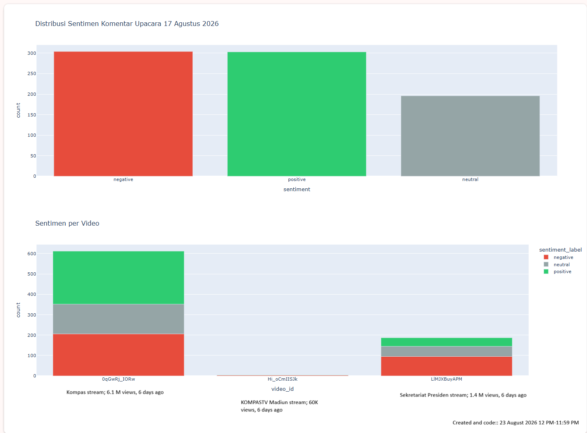

# sentiment-analysis-17-agustus-yt
Project submission for Pijak x IBM Skillsbuild
# Analisis Sentimen Komentar YouTube: Upacara 17 Agustus 2026

Pipeline analisis sentimen end to end untuk komentar YouTube terkait liputan Upacara 17 Agustus 2026.

## Arsitektur Pipeline

```
YouTube Data API v3 → raw JSON (bronze) → comments.csv (silver) → comments_scored.csv (gold) → visualisasi
```

- **Bronze layer**: respons mentah JSON per video, disimpan tanpa diubah
- **Silver layer**: `comments.csv`, hasil flatten dari raw JSON ke tabel terstruktur
- **Gold layer**: `comments_scored.csv`, tabel silver ditambah label sentimen dan confidence score

## Sumber Data

Komentar diambil dari 3 video YouTube via YouTube Data API v3 (`commentThreads.list`):

- Kompas
- KOMPASTV Madiun
- Sekretariat Presiden

Total komentar terkumpul: **803**

## Model

Klasifikasi sentimen menggunakan Hugging Face `pipeline`, model [`w11wo/indonesian-roberta-base-sentiment-classifier`](https://huggingface.co/w11wo/indonesian-roberta-base-sentiment-classifier), RoBERTa berbahasa Indonesia yang di-fine-tune pada dataset SmSA (IndoNLU benchmark). 3 kelas: `positive`, `neutral`, `negative`.

Teks diberikan ke model dalam bentuk asli (tanpa stemming), karena model dilatih pada teks natural, bukan teks yang sudah di-stem.

## Hasil

| Sentimen | Jumlah |
|---|---|
| Negative | 304 |
| Positive | 303 |
| Neutral | 196 |

Sentimen publik hampir terbelah rata antara positif dan negatif, dengan selisih hanya 1 komentar, bukan respons yang condong tajam ke satu arah.

## Visualisasi



Dibuat dengan Plotly Express: distribusi sentimen keseluruhan dan pembagian sentimen per video.

## Cara Menjalankan

1. Buka notebook di Google Colab.
2. Buat API key YouTube Data API v3 lewat Google Cloud Console, simpan sebagai secret `YOUTUBE_API_KEY` di Colab.
3. Isi `VIDEO_IDS` dengan ID video yang ingin dianalisis.
4. Jalankan sel secara berurutan: ingestion → flatten ke CSV → scoring sentimen → visualisasi.

## Tech Stack

- Python
- YouTube Data API v3
- Hugging Face Transformers
- Pandas
- Plotly Express
